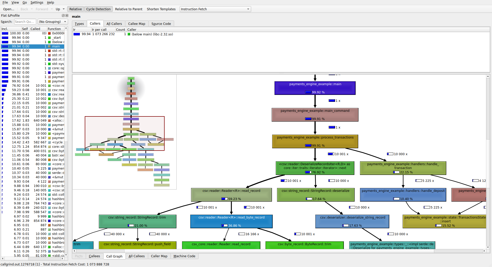
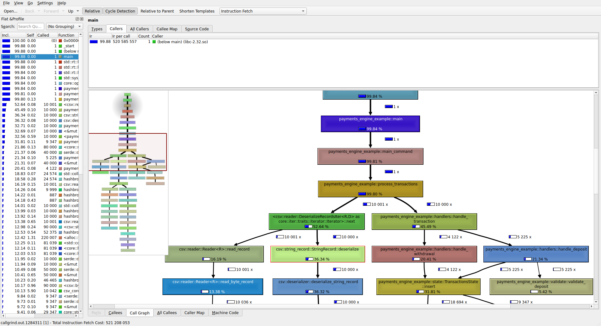
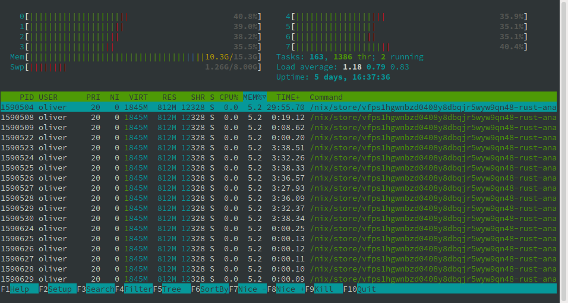

[](https://app.travis-ci.com/OliverEvans96/payments-engine-example)
[](https://oliverevans96.github.io/payments-engine-example/payments_engine_example/index.html)

<!-- [](https://coveralls.io/github/OliverEvans96/payments-engine-example?branch=main) -->

# Payments Engine Example

```
payments-engine-example 0.1
Oliver Evans <oliverevans96@gmail.com>
Simple engine to process streaming financial transactions and write final account balances as output.

USAGE:
    payments-engine-example [FLAGS] [OPTIONS] <input-csv-path>

FLAGS:
    -h, --help       Prints help information
        --notrim     Disable trimming whitespace from CSV records. This can speed up deserialization significantly
    -V, --version    Prints version information

OPTIONS:
    -b <batch-size>                 Batch size for parallel CSV deserialization [default: 1000]
    -d <deserialize-workers>        Number of threads to dedicate to deserialization. Defaults to half of the system's
                                    logical cores

ARGS:
    <input-csv-path>    Path to transactions CSV file, or '-' for stdin
```


## Problem Overview

The prompt for this exercise is as follows:

We have many clients, each of whom have a single account.
Each account has three balances:
- `available` - amount of money available for withdrawal / use
- `held` - amount of disputed funds not currently available
- `total` - sum of `available` and `held`

There are five types of transactions:
- deposit - the client adds funds to their account.
- withdrawal - the client removes funds from their account.
- dispute - the client requests that a transaction be reversed. Previously available funds from the transaction become held.
- resolve - a dispute is settled, and the original transaction stands.
- chargeback - a dispute is settled, and the transaction is reversed. The client's account becomes frozen.

Note that disputes, resolves, and chargebacks don't have their own transaction ids, they only reference deposits and withdrawals.

Given a sequence of input transactions in CSV format, this program should write CSV records to `stdout` with the final state of all accounts.

Input CSVs (`transactions.csv`) look something like this:

```
type,        client,  tx,     amount
deposit,     1443,    1,      1216.5774
deposit,     2838,    2,      606.6812
dispute,     2842,    729,
withdrawal,  3607,    858,    3378.8557
chargeback,  6730,    1131,
withdrawal,  57,      9995,   11382.196
deposit,     91,      9996,   4189.032
resolve,     1302,    3383,
deposit,     20,      9997,   1914.785
dispute,     4317,    772,
chargeback,  6305,    2142,
resolve,     1577,    1581,
deposit,     18,      10000,  3938.4937
```

and output CSVs (`accounts.csv`) look like this:

```
client,  available,  held,  total,      locked
28,      12825.617,  0.0,   12825.617,  false
90,      2165.9717,  0.0,   2165.9717,  false
82,      20159.152,  0.0,   20159.152,  false
22,      4659.0273,  0.0,   4659.0273,  true
51,      2993.004,   0.0,   2993.004,   false
87,      25676.127,  0.0,   25676.127,  false
45,      3706.6443,  0.0,   3706.6443,  false
83,      26884.957,  0.0,   26884.957,  false
52,      4030.088,   0.0,   4030.088,   false
```


## Solution Overview

So let me tell you what I've done.


### Assumptions

Having very little knowledge of banking, the prompt inevitably leaves a bit of room for interpretation.
I've made the following assumptions:
- Deposits and withdrawals must have positive amounts.
- Once a transaction has been disputed and settled, it can't be re-disputed. Otherwise, you risk chargeback loops, which is certainly not desirable.
- Locked accounts cannot deposit or withdrawal, but can dispute, resolve and chargeback.
- **Only deposits can be disputed**. Given the instruction that disputes should _increase_ the `held` amount, I just haven't figured how that would make sense if disputing withdrawals were allowed.
- Negative balances are not impossible. If a deposit, withdrawal, dispute-deposit sequence yields a negative balance, it's our fault for approving the chargeback.


### Data Structures

The approach I'm taking is pretty straightforward.
I'm storing all application state in a single `State` struct, which has three fields: `accounts`, `transactions`, and `disputes`, each having type `AccountsState`, `TransactionsState`, and `DisputesState` respectively.

- `AccountsState` simply wraps a `HashMap` of `Account`s indexed by `client_id`.
- `TransactionsState` has a two parts:
    - a nested `HashMap` pair, indexing transactions by client, then by transacion id for transaction lookups
    - a `HashSet` of all transaction ids for duplicate identification
- `DisputesState` has two fields, both of which are `HashSets` of `tx_id`s nested inside of a `HashMap` keyed by `client_id`. One field is for actively disputed transaction ids, and the other is for previously disputed (settled) transactions.

Using outer `HashMaps` in these data structures to group by `client_id` is not strictly necessary, and I wasn't initially doing this, but it became necessary once I wanted to generate valid test transactions, and I thought it would eventually make parallelizing transaction processing simpler, since in the current paradigm, all accounts are independent, making for theoretically low-hanging parallelizable fruit.


### The Life of a Transaction

I'm using `serde` and the `csv` crate to deserialize each CSV lines into a `TransactionRecord` struct, which contains a `TransactionType` enum.
Then, I'm `match`ing on `TransactionType` to convert to a specific type of transaction (e.g. `Dispute`, `Withdrawal`), which implements the common `Transaction` trait.

That struct then gets validated, checking that both it's well-formatted and has sensible values, _and_ that it's a legal transaction considering current state of the engine based on all previous transactions.

The last step of each validation function is to return an `AccountAccess` enum, which gives _appropriate_ mutable access to the account in question based on its current state.
It may be of a `Locked` or `Unlocked` variant depending on the state of the account.
The `Locked` variant wraps a `LockedAccount` struct, and the `Unlocked` variant wraps an `UnlockedAccount`.
Both `LockedAccount` and `UnlockedAccount` implement the `BaseAccountFeatures` trait, which allow updating account balances for disputing, resolving, or charging-back previous transactions.
But only `UnlockedAccount` implements `UnlockedAccountFeatures`, which allows updating balances for new deposits and withdrawals, as well as locking the account.
Currently, the system has no concept of unlocking an account, but this could be achieved via a `LockedAccountFeatures` trait providing an `.unlock()` method, implemented only by `LockedAccount`. See `account.rs` for details.

Once the account has been updated, the transaction gets wrapped in a `TransactionContainer` enum with a variant for each relevant transaction type, and stored in the `state.transactions` HashMap for easy lookup down the road.

Currently, only withdrawals and deposits are being stored in `TransactionContainers`.
For now, it's just not necessary to store the other three, and they don't even have their own `tx_id`s.

Once all transactions have been processed, I iterate over the final `AccountsState`, convert each `Account` into an `OutputRecord` (which contains the derived `total` field, and rounds to four decimal places), an serialize back to CSV.

### Extensibility

I mentioned above that only deposits are disputable based on my limited understanding of the scenario.
Presumably, everything should be disputable in the real world.

Luckily, if someone comes along who knows how to dispute another type of transaction, they simply need to implement the `Disputable` trait for that type, which specifies how to modify balances for disputes, resolves, and chargebacks.
They'll also need to "register" this new implementation by adding a `match` arm to the `try_get_disputable` function on `TransactionContainer`, which attempts to downcast a specific transaction type into `impl Disputable` if we know how to do so. See `traits.rs` for details.


### Maintainability

I love Rust.
I just briefly wrote some python code after working in Rust for a while, and it felt so sloppy, I couldn't believe I've been okay with that for so long!
Between Rust's strong, expressive type system, its memory safety guarantees, helpful compile-time errors, and editor support from the fantastic rust-analyzer, it's generally very easy to understand code, and hack fearlessly without worrying about breaking something unexpectedly.

That said, Rust code can also devolve into an endless soup of chained iterators and turbofish.

In my opinion, the type system is the best way to communicate intent.
Comments are great, of course.
Short, well-named functions are super helpful.
But if you're able to teach the compiler itself what's allowed and what isn't in your domain, that leaves very little room for ambiguity for future developers.

I haven't been extremely strict in this repo about sticking to rigid style guidelines, but I've attempted to generally be explicit in the face of ambiguity, and use reasonable variable names.

A few specific, minor ways I've tried to improve readability are:
- Returning early / using the `?` syntax where reasonable
- Using getter / setter methods where reasonable, and generally communicating via public interfaces rather than via raw data access
- Using type aliases such as `TransactionId = u32`, `ClientId = u16`, and `CurrencyFloat = f32`. This is useful both for later refactoring and for communication of intent.


## Automated testing

Of course, perhaps the best way to keep code maintainable is to have a nice suite of automated tests that build confidence that your code hasn't broken after a big refactor.

In this repo, I've written both unit tests, found in most individual modules, and integration tests, found in the `tests` directory.

I'm using two types of integration tests:
- "data-driven" tests, read from subdirectories of `testdata`, each of which contain an input `transactions.csv` and an expected output `accounts.csv`. These are fully end-to-end, from CSV to CSV. They only test whether the final output is correct.
- "inline-data" tests, which run one or two specific transactions and check account state _and_ any generated errors. These are useful for making sure invalid transactions are handled appropriately.


## Generating Test Transactions

Once my code was working, I was of course curious how fast it was going.
But in order to get a reasonable sense of speed, I had to have a large input dataset to test against.
This led me to write the `TransactionGenerator` struct, which implements `Iterator<Item=TransactionRecord>`, generating an arbitrarily large sequence of **valid** transactions.
In practice, since accounts can be locked but not unlocked, there tend to be fewer possible transactions as time goes on.
This can be mitigated by adding more clients, but with the `u16` limit on `client_id`s, I've maxed out at generating about 10 million transactions.
I'm sure it's possible to squeeze out more transactions by fiddling with the ratios of `TransactionType`s (mainly fewer chargebacks).

I've split the transaction generation functions off into its own binary (`target/*/generate-transactions`), which can be used as follows:

```
generate-transactions 0.1
Oliver Evans <oliverevans96@gmail.com>
Generate random valid transactions for payment processing engine.

USAGE:
    generate-transactions [OPTIONS]

FLAGS:
    -h, --help       Prints help information
    -V, --version    Prints version information

OPTIONS:
    -a, --attempts <attempts>            Maximum number of times to attempt to generate a new valid transaction before
                                         aborting [default: 10000]
    -c, --clients <clients>              Maximum number of clients to generate transactions for. Client IDs will be
                                         between 1 and this number [default: 100]
    -d, --deposit <deposit>              Maximum amount for deposits [default: 10000]
    -t, --transactions <transactions>    Number of transactions to generate. Defaults to infinite (run until cancelled)
```


## Performance & Efficiency

With 10 million transactions in hand, I ran my code with `--release` to see how fast it could go.
As of commit `1bfde6d5, I was seeing about 716k tx/sec.

Curious where execution time was being spent, I ran a smaller dataset through `valgrind` / `callgrind` and visualized the call graph using `kcachegrind`:

### With `trim`



I noticed about a 3:1 ratio of time spent deserializing vs. processing transactions.
In particular, I noticed whitespace trimming accounting for a decent amount of time, so I added a flag to disable it.

With trimming disabled, it was about a 1:1 ratio of deserializing to processing, as shown below.

### Without `trim`



### Parallelizing Deserialization :)

Since the program appeared CPU-bound rather than IO-bound, my next step was to attempt parallelizing.

I used the `rayon` data-parallelism library to deserialize transactions in batches. 
Each batch was sent from a single `csv::StringRecord` thread through a `mpsc::channel` to be divided and deserialized among the worker threads.

Unfortunately, although my CPUs were hotter, the speedup wasn't considerable.
The processing times for 10 million transactions are given in the following table.

| # records  | algorithm    | trim  | time   | tx/sec |
|------------|--------------|-------|--------|--------|
| 10 million | serial       | true  | 13.95s | 716k   |
| 10 million | serial       | false | 10.87s | 920k   |
| 10 million | 4 x parallel | true  | 11.84s | 844k   |
| 10 million | 4 x parallel | false | 10.85s | 921k   |

Observing `htop`, I notice that even when spawning 8 worker threads for deserialization on my 8 core machine, less than half of my available CPU resources are used (Ignore the memory usage by my 17 billion browser tabs).



I suspect this indicates that the bottleneck is now transaction processing, and the deserializing workers are spending most of their time waiting since I'm using a buffered queue, so they can't produce significantly more than what's being processed down the line.

## Parallelizing Transaction Processing :(

The next step was to attempt to parallelize transaction handling.
In theory, this should be possible, since all accounts are independent.
So as long as no two threads are processing transactions for the same account simultaneously (lest they become disordered), there should be no issue.
However, in practice, it turned out to require a major refactor, which I had to abandon for the time being due to time constraints.

The main issue I ran into was that accessing shared data requires the introduction of `Arc<RwLock>`s and/or `Arc<Mutexes>`.
This didn't seem like a problem at first, until I realized that most of my state access was designed around returning containers wrapping `&T`s and `&mut T` references to the underlying data.
But data behind a `Mutex` or `RwLock` can't be trivially returned to the caller, because the RAII guard is generally a local variable on the callee's stack, which will be dropped on return.
You generally have to return the whole `Mutex` / `RwLock`, and let the caller access the data themselves, and that just turned out to be a radical shift from the approach I had been taking.

Now, it is actually possible to return references to objects behind locks.
In particular, I found some discussion [on StackOverflow](https://stackoverflow.com/questions/40095383/how-to-return-a-reference-to-a-sub-value-of-a-value-that-is-under-a-mutex) mentioning two potential approaches:
- The [`owning_ref`](https://kimundi.github.io/owning-ref-rs/owning_ref/index.html) crate, which bundles a `MutexGuard` with the underlying data to prevent `.drop` from being called
- `parking_lot::Mutex` has a `Mutex::map` function which maps the mutex guard to a reference derived from the object it guards.

I still haven't quite wrapped my head around first option. I think I understand the concept in theory, but my mental model didn't seem to line up with the compiler errors I was getting. 
The second option was very easy to use, but unfortunately didn't quite work for me either.

And why is that?
Because of my darn nested HashMaps.
Starting from a `RwLock<HashMap<ClientId, Arc<Mutex<Account>>>>` and attmpting a `Mutex::map`, I couldn't just return a reference from `&HashMap<ClientId, Arc<Mutex<Account>>>` to `&Account`, because the inner `Mutex` has to _also_ be locked, which requires allocating a second RAII guard, which is dropped when the closure to get the inner reference finishes.

So that's the story of my attempted parallelism in transaction processing.
If anyone has actually read this far and has any ideas about how to proceed, I would really love to hear what you think.


## Safety & Error Handling

I didn't use any `unsafe` in this project.
I generally handled errors by propagating them as far up the thread as possible, then reporting them with `log::error!(...)` + `env_logger` for runtime-determined verbosity.

I tried to avoid `.unwrap` or `.expect`. 
I might have thrown it in once or twice in a simple test case, but I think my code should not panic for the most part.


## Command Line Interface

To define the command line interface, I used [`structopt`](https://docs.rs/structopt/0.3.23/structopt/), which is a very nice wrapper around [`clap`](https://docs.rs/clap/2.33.3/clap/) that uses proc macros on a user-defined struct instead of the unweildy builder spaghetti that raw `clap` appears to be.

## CI / CD

I also set up Travis CI to build & test the code, as well as generate documentation and push is to GitHub pages.
See the badges at the top of this README.

## Thanks! 🎉

Thanks for reading :) I hope you're having a nice day!
